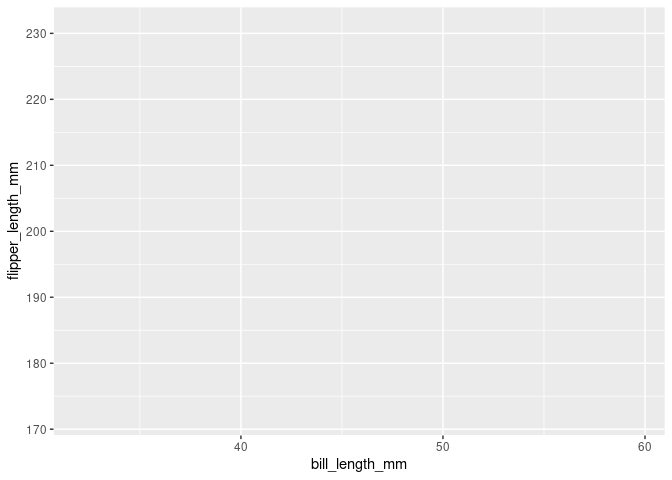

<!-- README.md is generated from README.Rmd. Please edit that file -->

# atelier

<!-- badges: start -->

<!-- badges: end -->

The goal of atelier is to gather small helper functions I use across my
projects.

## Installation

You can install the development version of atelier from
[GitHub](https://github.com/) with:

``` r
# install.packages("pak")
pak::pak("tblk/atelier")
```

## Example

This is a basic example which shows you how to solve a common problem:

``` r
library(atelier)
#> 
#> Attachement du package : 'atelier'
#> L'objet suivant est masqué depuis 'package:datasets':
#> 
#>     penguins
acronym("Robert Hertz")
#> [1] "rh"
```

`legend_inside` is useful helper for ggplot2. Here is an example with
the palmerpenguins::penguins data.

``` r
library(ggplot2)
penguins |>
  ggplot(aes(x = bill_length_mm,
             y = flipper_length_mm,
             colour = species)) +
  geom_point() +
  legend_inside() +
  theme_minimal()
#> Warning: Removed 2 rows containing missing values or values outside the scale range
#> (`geom_point()`).
```



``` r
citation("palmerpenguins")
#> To cite palmerpenguins in publications use:
#> 
#>   Horst AM, Hill AP, Gorman KB (2020). palmerpenguins: Palmer
#>   Archipelago (Antarctica) penguin data. R package version 0.1.0.
#>   https://allisonhorst.github.io/palmerpenguins/. doi:
#>   10.5281/zenodo.3960218.
#> 
#> Une entrée BibTeX pour les utilisateurs LaTeX est
#> 
#>   @Manual{,
#>     title = {palmerpenguins: Palmer Archipelago (Antarctica) penguin data},
#>     author = {Allison Marie Horst and Alison Presmanes Hill and Kristen B Gorman},
#>     year = {2020},
#>     note = {R package version 0.1.0},
#>     doi = {10.5281/zenodo.3960218},
#>     url = {https://allisonhorst.github.io/palmerpenguins/},
#>   }
```
